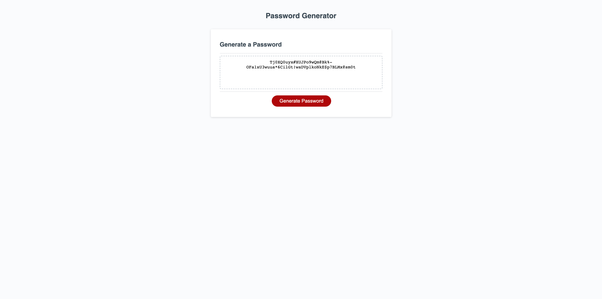

# Password-Generator

## Description

This project was created for the purpose of generating random passwords. It solves the problem of creating passwords by yourself.
During the process of the building this porject I learned add a string to an exsiting empty string and then call it. I learned how to randomize strings, and also utilize prompts to gather the users input to trigger an event.

## Installation

You will need a browser installed on your local machine to run this application. Follow these steps:

1. Clone the reopsitory with the follwoing command: 'git clone https://github.com/StunnaDawg/Password-Generator

2. CD into the repository on your local machine

3. Open the index.html with your default browser

## Deployed Link

https://stunnadawg.github.io/password-generator/

## Screenshot

## Credits

- generatePasswordLength Function:
    https://stackoverflow.com/questions/1349404/generate-random-string-characters-in-javascript
